Von Februar 2018 bis September 2021 haben wir mit dem Projektpartner
**ISTplanbar GmbH**, Recklinghausen, das **Emscher-Lippe-Thingsnet** aufgebaut:
ein LoRaWAN-Funknetz, über das Sensoren in der Emscher-Lippe-Region Messdaten
ins Internet übertragen können. Aus einem einzigen Gateway im Mai 2019 wurden
bis zum Projektende rund 85, dazu kamen Workshops für Schulen und Anwender und ein
Bürger-Messnetz für Feinstaub in Bottrop. Wir zeigen hier eine Rückschau auf das Projekt.

<!--more-->


Die Ergebnisse wurden zum Projektende im September 2021 dem Expertenbeirat
als Schlussauswertung vorgestellt. Die Präsentation steht
[unten zum Download](#präsentation) bereit. Karten, Messwerte und
Plattformen geben den Stand von 2021 wieder.


## Überblick

| | |
|---|---|
| **Laufzeit** | 01.02.2018 – 30.09.2021 |
| **Förderung** | Land Nordrhein-Westfalen, Ministerium für Wirtschaft, Innovation, Digitalisierung und Energie |
| **Beteiligt** | Evangelischer Kirchenkreis Recklinghausen, ISTplanbar GmbH, Recklinghausen |
| **Ziel** | Digitalisierung der Emscher-Lippe-Region durch eine offene IoT-Infrastruktur |
| **Netz** | ca. 85 LoRaWAN-Gateways (Ausgangsannahme: ca. 50) |
| **Hardware** | ca. 400–500 Sensoren, über 25 Lernpakete, rund 40 Test-Gateways für Schulen und Workshops |
| **Anwendungsfall** | Feinstaubmessung mit 34 selbst gebauten Sensorstationen in Bottrop |

## Warum LoRaWAN?

LoRaWAN (*Long Range Wide Area Network*) ist ein Funkstandard für das Internet
der Dinge. Er ist darauf ausgelegt, kleine Datenmengen über große Entfernungen
mit sehr geringem Energiebedarf zu übertragen:

- **Reichweite:** mehrere Kilometer pro Gateway, auch in bebautem Gebiet
- **Energiebedarf:** batteriebetriebene Sensoren können jahrelang ohne
  Wartung arbeiten
- **Frequenzen:** lizenzfreies Band, keine Mobilfunkverträge nötig
- **Architektur:** Sensoren senden an Gateways, die die Daten an einen
  Netzwerkserver und von dort an die jeweilige Anwendung weiterleiten

Damit eignet sich LoRaWAN für Messaufgaben, bei denen es nicht auf große
Datenmengen, sondern auf Fläche und lange Laufzeit ankommt – etwa Umwelt- und
Klimamessungen, Füllstände oder Raumklima.

## Das Vorhaben

Vorbild waren Smart Cities wie Amsterdam, Barcelona, Chicago, Manchester,
Singapur und Turin. Dort liefern Sensor- und Aktornetze Bürgerinnen, Bürgern
und Stadtverwaltungen Umweltdaten zur Daseinsvorsorge und ermöglichen Dienste
wie

- die Echtzeit-Anzeige freier **Parkplätze**,
- ein **Abfallbehälter-Management** mit Füllstandssensoren,
- die Wartung von Brücken und Verkehrswegen mit **Erschütterungssensoren**,
- die **Leckageüberwachung** von Wasserleitungen,
- die Überwachung von **Temperatur und Feuchtigkeit** und Warnungen bei
  extremen Wetterlagen,
- Monitoring und Reporting der **Luftqualität** in Echtzeit.

Mit Test-Knotenpunkten in Recklinghausen und weiteren Städten der
Emscher-Lippe-Region sollte – gemeinsam mit sachkundigen Expertinnen und
Experten – ein **öffentlich zugängliches Infrastruktur-Netzwerk** für die
Kommunen und ihre Bürgerinnen und Bürger entstehen und evaluiert werden. Geplant
war, 50 bis 100 Test-Sensorstationen an dieses Netz anzubinden.

### Partner und Themenfelder

Als Kooperationspartner waren Kommunen der Emscher-Lippe-Region,
Wirtschaftsförderungen, der Kreis Recklinghausen, FabLabs an lokalen
Hochschulen, Firmen, Krankenhäuser, die Diakonie, Berufskollegs und
Umweltschutzinitiativen beteiligt.

Inhaltlich verband das Projekt zwei Themenfelder:

- **Bewahrung der Schöpfung / Umwelt- und Naturschutz** – Arbeit im
  Konfliktgebiet.
- **Digitalisierung als emanzipatorische Bildung** – Beteiligung, Transparenz,
  Gehörtwerden, Bottom-up-Politik, Selbstwirksamkeit und die sozialethische
  Reflexion von Technik und Politik.

### Der Evaluationsauftrag

Ein Arbeitspaket war dem **Expertenbeirat Evaluation** gewidmet. Seine Aufgabe:
die wissenschaftliche Begleitung der Wetter- und Umweltmessungen, also

- die **Prüfung der Messgenauigkeit** im Parallelbetrieb mit „offiziellen“
  Luftmessstationen,
- die **Auswertung** der gewonnenen Messdaten und
- die **vergleichende Auswertung der Präsentationsschichten**, über die die
  Daten veröffentlicht werden.

Die Ergebnisse dieser Evaluation stehen im Abschnitt
[Wie genau messen die Sensoren?](#evaluation-wie-genau-messen-die-sensoren).

---

## Aufbau des Netzes: von 1 auf rund 85 Gateways

Die Ausgangsannahme lautete: Für eine flächendeckende LoRaWAN-Versorgung der
Emscher-Lippe-Region sind **etwa 50 Gateways** erforderlich.

Im Mai 2019 gab es ein einziges Gateway des Projekts, auf dem **Klinikum Vest**
an der Dorstener Straße in Recklinghausen. Schon dieses eine Gateway empfing
Sensoren bis nach Dorsten – rund 19 km entfernt.

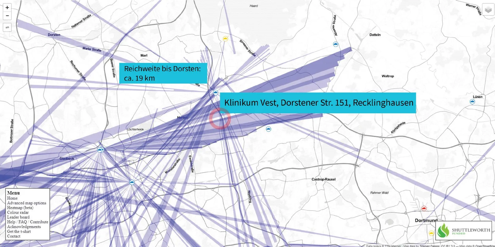

Die Gateways sind in das offene Community-Netz **The Things Network (TTN)**
eingebunden. Die Karten stammen von *TTN Mapper*: Jede Linie steht für eine
tatsächlich gemessene Funkverbindung zwischen einem Sensor und einem Gateway.

Bis September 2021 wuchs das Netz auf **rund 85 ELTN-Gateways**. Die
Ausgangsannahme von 50 Gateways wurde damit deutlich übertroffen. Zwischen
Dorsten, Marl, Datteln, Waltrop, Gladbeck, Herten und Castrop-Rauxel war die
Region damit weitgehend abgedeckt.

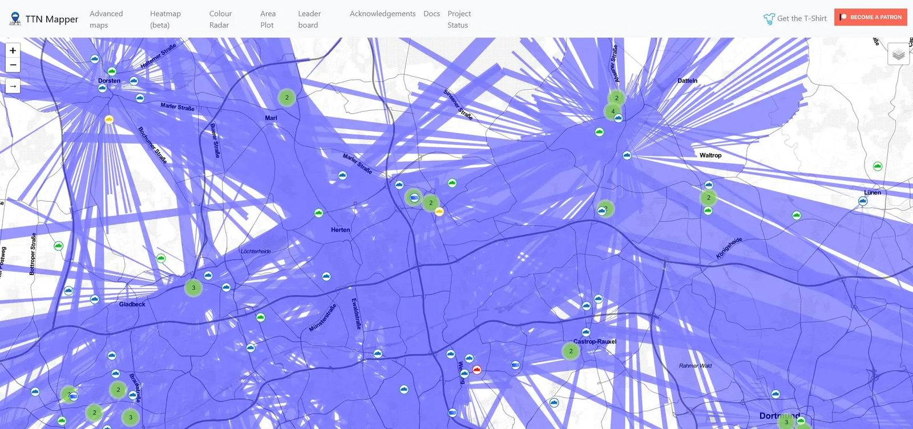

## Workshops und Anwender-Sessions

Ein Netz ist nur so viel wert wie seine Nutzung. Deshalb gehörten Workshops
von Anfang an zum Projekt – vor Ort und, ab Ende 2020, auch online.

| Datum | LoRaWAN-Workshop |
|---|---|
| 20.10.2018 | Recklinghausen |
| 18.05.2019 | Recklinghausen |
| 25.07.2019 | Gelsenkirchen |
| 12.12.2020 | online |
| 09.04.2021 | Gladbeck |
| 17.07.2021 | online |

Dazu kamen Multiplikatorenveranstaltungen und Anwender-Sessions mit
Einrichtungen und Unternehmen, unter anderem:

| Datum | Ort / Partner |
|---|---|
| 11.10.2018, 31.10.2018, 18.12.2018, 24.01.2019, 30.01.2019, 12.03.2019 | Hagen |
| 19.12.2018 | GC Heat |
| 02.04.2019, 12.06.2019 | Textlight |
| 29.05.2019 | Diakonie |
| 01.10.2019 | Dorsten |
| 10.10.2019 | Datteln, Uniper |
| 07.02.2020, 09.03.2020 | Herne |
| 28.02.2020 | Dorsten, Raiffeisen |

### Hardware für Lerngruppen

Für die Arbeit mit Schulen und Workshop-Gruppen wurden Lernpakete
zusammengestellt, mit denen sich eigene LoRaWAN-Sensoren bauen lassen:

- **über 25 Lernpakete** ausgegeben, jeweils mit sechs Einzelkomponenten
  für Licht, Ultraschall, Luftfeuchte und mehr,
- insgesamt **ca. 400–500 Sensoren** mit und ohne Gateways, darunter
  **rund 40 Single-Channel-Gateways** zum Testen an Schulen und für
  Teilnehmende der Workshops,
- **Dauereinsatz von 34 Sensorpaketen in Bottrop** für Feinstaub, Temperatur,
  Luftdruck und Luftfeuchte (siehe unten),
- **Dauereinsatz von Sensoren** bei der WINDOR in Dorsten und den Stadtwerken
  Herne.

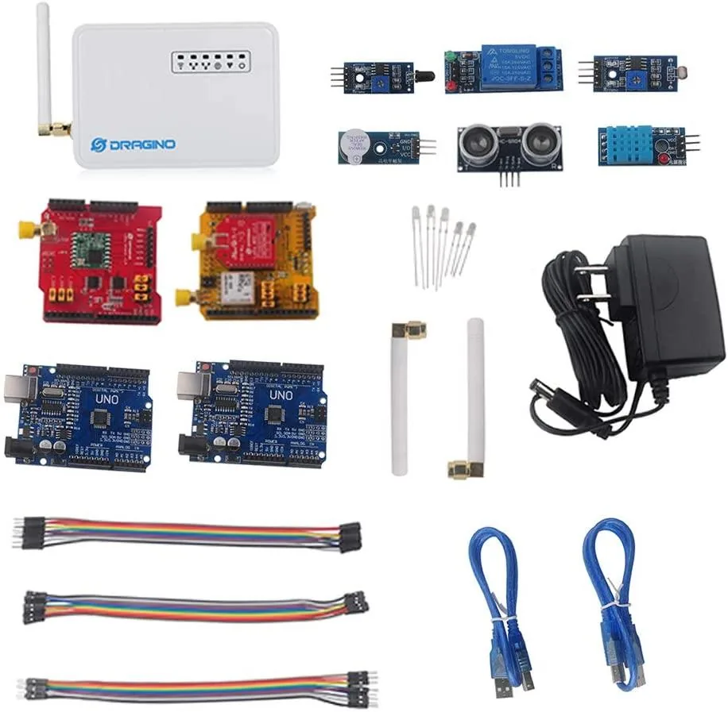

Single-Channel-Gateways empfangen nur auf einem Funkkanal. Für den regulären
Netzbetrieb reichen sie nicht aus, für das Lernen und Testen sind sie aber
günstig und einfach einzurichten.

---

## Anwendungsfall: Feinstaubmessungen in Bottrop

### Anlass

Anlass der Aktivitäten in Bottrop waren Messungen polyzyklischer aromatischer
Kohlenwasserstoffe (PAK). Auf ihrer Grundlage gibt die Stadt Bottrop Empfehlungen für den Anbau und Verzehr von selbst
angebautem Obst und Gemüse. Je nach Bereich gilt: höchstens viermal pro Woche,
höchstens dreimal pro Woche – oder gar kein Verzehr von Blattgemüse.

.")

### Die offizielle Messstation

Das Landesamt für Natur, Umwelt und Verbraucherschutz NRW (**LANUV**) betreibt
in **Bottrop-Welheim** eine Luftmessstation (Kürzel BOTT, EU-Kennung
DENW021). Der Messcontainer steht seit 1981 auf der Grünfläche eines
Schulgeländes an der Welheimer Straße. Etwa 1 km östlich verläuft die B 224,
rund 700 m südwestlich beginnt das Gelände einer Kokerei, daran schließen sich
ein Industrieareal und das Hafengebiet am Rhein-Herne-Kanal an.

Die Station misst unter anderem **Feinstaub (PM10)**, Ozon, Stickoxide,
Schwefeldioxid, Temperatur, Luftfeuchte sowie Windrichtung und
-geschwindigkeit. Zusätzlich wertet das LANUV Tagesproben auf Inhaltsstoffe des
Feinstaubs aus, etwa Blei, Cadmium und Nickel sowie **Benzo[a]pyren**, die Leitsubstanz der
PAK.


**Empfehlung des Beirats:** die Korrelation von PM10 und Benzo[a]pyren unter
Einbeziehung der Windrichtung überprüfen.


### Selbst gebaute Sensoren

Die Bottroper Messstationen wurden nach dem Vorbild des Projekts
*luftdaten.info* (heute *Sensor.Community*) selbst gefertigt – mit dem
Unterschied, dass sie ihre Daten per LoRaWAN statt über WLAN übertragen. Ein
Feinstaubsensor und ein Klimasensor für Temperatur, Luftfeuchte und Luftdruck
sitzen wettergeschützt in einem Gehäuse aus zwei Abwasserrohrbögen, das
Funkmodul sendet über eine außen liegende Antenne.

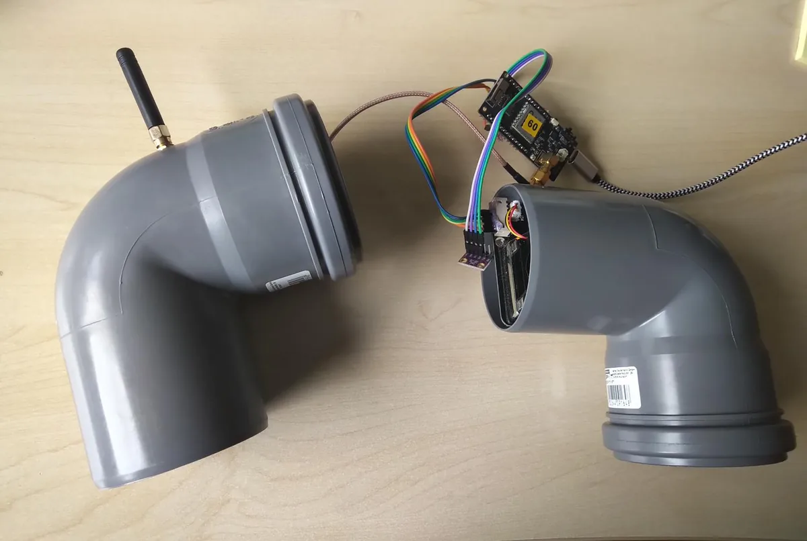

Aufgestellt wurden die Sensoren bei Bürgerinnen und Bürgern – etwa unter einem
Terrassendach oder an einer Hauswand. So entstand ein Messnetz, das die
Belastung dort erfasst, wo Menschen wohnen, und nicht nur am Standort der
offiziellen Station.

### Daten für alle: drei Präsentationsschichten

Die Messwerte werden über drei Plattformen veröffentlicht, die sich in Zugang
und Funktionsumfang unterscheiden:

| Plattform | Zugang | Stärke |
|---|---|---|
| **Sensor.Community** (luftdaten.info) | öffentlich | Kartenansicht gemeinsam mit weiteren Sensoren der Community, einfache Verlaufsdiagramme je Sensor |
| **openSenseMap** | öffentlich | Gruppe „Bottrop-Feinstaub“ mit aktuellen Werten je Station, Download der Rohdaten |
| **Grafana** | exklusiv für das Bottroper Messnetz | detailliertes Dashboard mit Mess- und Gerätedaten, Download der Rohdaten |

**Sensor.Community** färbt die Waben auf der Karte nach der aktuellen
Feinstaubkonzentration ein. Für jeden Sensor lassen sich die letzten 24 Stunden
und der gleitende 24-Stunden-Mittelwert für PM2.5 und PM10 abrufen.

.")

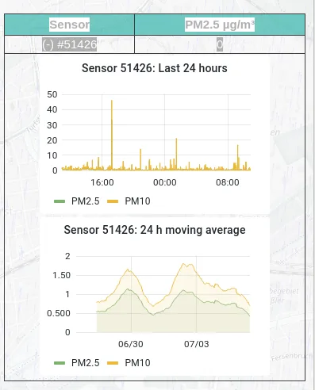

Auf der **openSenseMap** sind die Bottroper Stationen als Gruppe
zusammengefasst. Zu jeder Station zeigt sie PM10, PM2.5, Temperatur, relative
Luftfeuchte und Luftdruck; über *Data download* lassen sich die Rohdaten
exportieren.

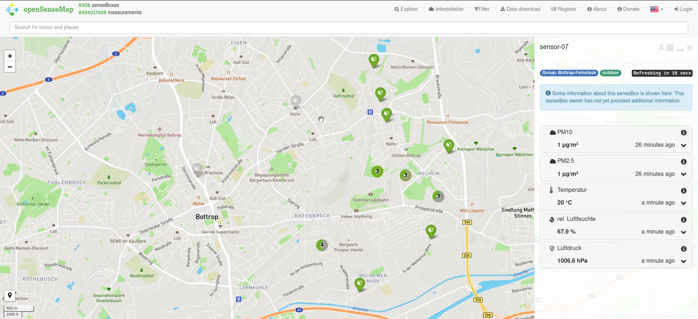

Das **Grafana**-Dashboard geht am weitesten: Neben Temperatur,
Luftfeuchtigkeit, Taupunkt, Luftdruck und Feinstaub – auch als Tagesmittel –
zeigt es Gerätedaten wie Eingangsspannung, Laufzeit, CPU-Temperatur,
Speicherbelegung und die Empfangsstärke am Gateway. Damit lassen sich
Messwerte und technische Probleme einer Station im Zusammenhang betrachten.

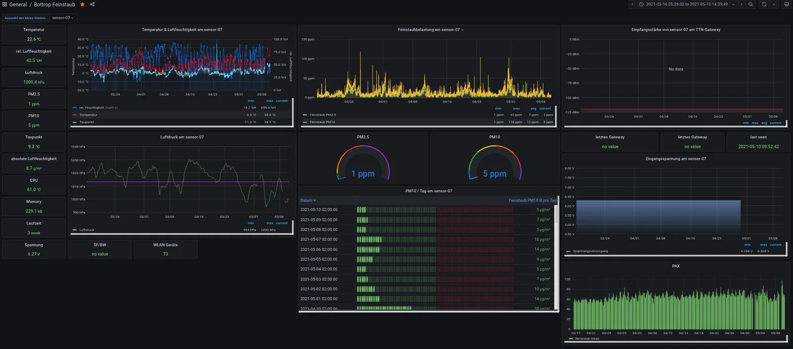

---

## Evaluation: Wie genau messen die Sensoren?

Für die Prüfung der Messgenauigkeit wurden die Werte der eigenen Sensoren mit
denen der LANUV-Station Bottrop-Welheim verglichen. Mehrere der eigenen Sensoren
stehen in der Umgebung der Station.

.")


Das LANUV veröffentlicht Feinstaubwerte als **gleitende 24-Stunden-Mittel**,
die Sensoren liefern dagegen Einzelmessungen. Die
LANUV-Kurven verlaufen deshalb deutlich glatter; kurze Spitzen in den
Sensordaten sind nicht automatisch Messfehler. Zudem sind die aktuellen
LANUV-Werte vorläufig und noch nicht validiert.


### Messlücken

Anders als die LANUV-Station liefern die eigenen Sensoren keine lückenlosen
Zeitreihen. Bei Sensor-05 fehlen etwa im Januar, Ende Februar/Anfang März und
im Juli 2021 Daten über längere Zeiträume.

 im Vergleich zur LANUV-Station (unten).")


**Empfehlung des Beirats:** einen eigenen Sensor in direkter Nähe zum
LANUV-Sensor aufstellen, um einen Vergleich am selben Ort zu ermöglichen.


### Abweichungen bei PM10

Im direkten Vergleich zeigen sich zwei Arten von Abweichungen:

- **Sensor-13** liegt mal über, mal unter der LANUV-Station und zeigt immer
  wieder Spitzen weit über 100 µg/m³, während die Station moderate Werte
  meldet. Für die Darstellung wurden Ausreißer über 126 µg/m³ abgeschnitten.
- **Sensor-07** bildet bis zum Sommer 2021 die Spitzen und Täler der
  LANUV-Kurve recht gut nach. Nach dem Einsatz eines **Austauschsensors**
  liegen die Werte dagegen dauerhaft bei wenigen µg/m³ – deutlich unter denen
  der Station. Ein neues Gerät ist also nicht automatisch ein verlässliches Gerät.

 und Sensor-07 mit Austauschsensor (unten).")

Die **prozentualen Abweichungen** von Sensor-02 und Sensor-05 gegenüber der
LANUV-Station schwanken fortlaufend im Bereich von etwa +100 % bis −100 %. Hinzu kommen
Ausschläge bis −600 % und −700 %, bei denen der Sensor ein Vielfaches des
LANUV-Werts meldete. Die Unterschiede sind also nicht nur ein Problem
einzelner Ausreißer.

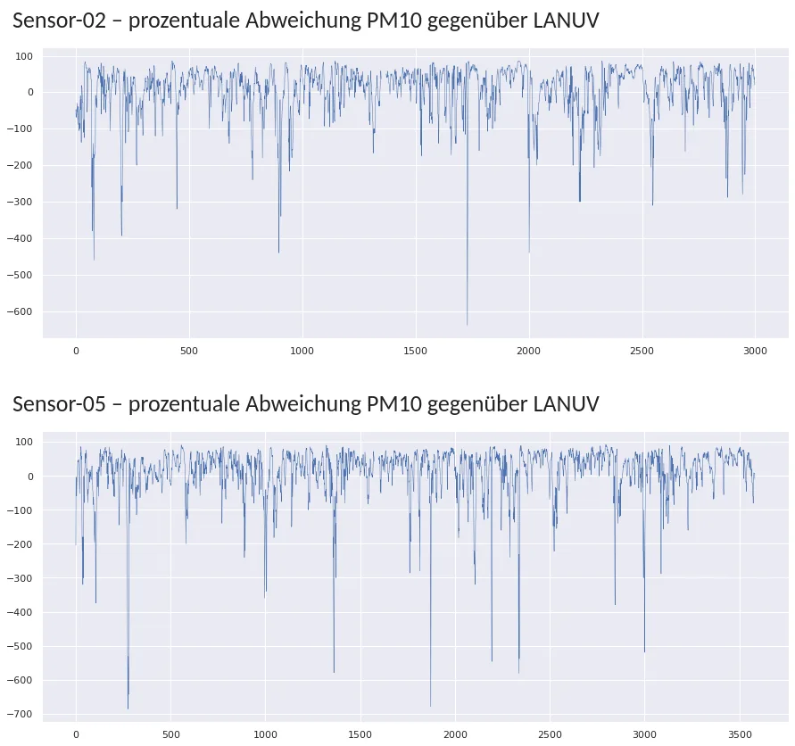

Die **Verteilung** der Messwerte macht das Muster deutlich. Der Median der
Sensoren (Sensor-13 und Sensor-18) liegt mit rund 8–9 µg/m³ deutlich unter dem
der LANUV-Station (rund 17 µg/m³). Gleichzeitig produzieren die Sensoren
zahlreiche Ausreißer bis über 120 µg/m³, die Station dagegen nur bis etwa
50–60 µg/m³. Das LANUV veröffentlicht gleitende 24-Stunden-Mittel; dies erklärt einen Teil der Unterschiede.

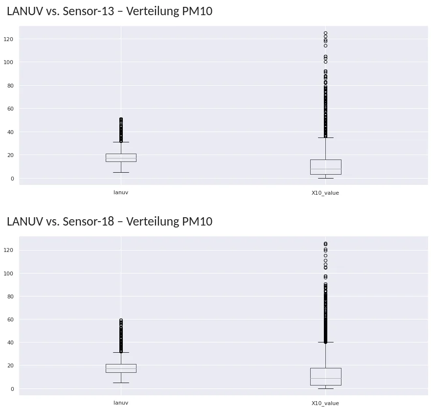

Eine Auswertung nach Uhrzeit und Tag zeigt, dass sich die großen Abweichungen
auf einzelne Tage und Tageszeiten konzentrieren, etwa auf die frühen
Morgenstunden. Die Auswertung wirft deshalb die Frage auf, ob **lokale
Störeffekte** in der Nähe einzelner Sensoren dahinterstecken – etwa Emissionen
von Hausfeuerungsanlagen wie Holzöfen.

### Luftfeuchte

Bei der relativen Luftfeuchte fallen die Sensoren seltener aus, und es gibt
weniger Ausreißer. Trotzdem liegen die Werte häufig unter denen der
LANUV-Station, und vereinzelte Werte über 100 % sind physikalisch unmöglich.
Auch hier gilt: **Ohne Kalibrierung sinkt die Qualität der Messwerte.**

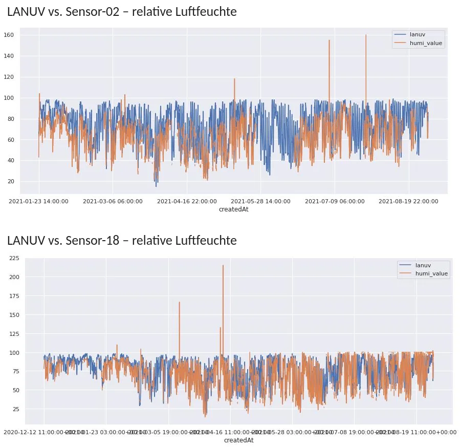

---

## Erfahrungen mit LoRa-Sensoren

Neben den Umweltmessungen wurden im Projekt zahlreiche handelsübliche
LoRaWAN-Sensoren im Praxiseinsatz getestet.

**Bewährt haben sich:**

- Überwachung von Türöffnungen, Schalt- und Serverschränken
- GPS-Tracker in verschiedenen Varianten, vor allem von Dragino; Tracking
  (Trackio-GPS) in einem Nextcloud-Dashboard mit OpenStreetMap und Google Maps
- Lichtschranken
- CO₂-Sensoren mit guter Aussagekraft, auch als Bastelsets in Schulen
- Sensoren von Elsys, die sich problemlos per Funk (OTA) aktualisieren lassen
- Temperatursensoren für Heizungsanlagen in verschiedenen Varianten, innen
  und außen
- Helligkeitssensoren, um den Türstatus zu erkennen, etwa bei Serverschränken
  oder Garagen
- Bodenfeuchtesensoren für Pflanzen und Bäume
- Sensoren an Feuermeldern zur Zustandsfernwartung

**Nicht bewährt haben sich:**

- Parksensoren: mehrere Defekte und Rückrufe der Hersteller; Sensoren von
  Bosch ließen sich nicht auf Version 3 des TTN-Stacks (TheThingsNet) aktualisieren, und einbetonierte Sensoren
  sind nur schwer zurückzuholen
- Präsenz- und Bewegungsmelder: liefen schlecht, der Anbieter ging in Konkurs
- Schallsensoren: kein echter Kundeneinsatz, schlecht geeignete Gehäuse
- Füllstandssensoren in Metallbehältern: funktionieren nicht, da der
  Ultraschall reflektiert wird
- Erschütterungssensoren: wenig brauchbare Ergebnisse
- Reedkontakte: schwer an beweglichen Rolltoren anzubringen; ein Lichtsensor
  im Kohlebunker bei der WINDOR erwies sich als problematisch

Auffällig ist, dass gerade einige der Smart-City-Anwendungen aus der
Vorhabenbeschreibung – Parkplätze, Füllstände, Erschütterungen – in der Praxis
die meisten Schwierigkeiten bereiteten.

## Die Projektwebsite

Auf der Website **Emscher-Lippe-Things.net** informierte das Projekt über
Nachrichten, Termine, Workshops und Info-Material. Dort wurden auch
Anwendungen aus der Region vorgestellt – etwa die Evangelische Gemeinde
Haltern, die per LoRaWAN-Sensor Temperatur und Luftfeuchtigkeit in der
Erlöserkirche misst. Aus den Messwerten lässt sich der Taupunkt berechnen, so
dass rechtzeitig gelüftet werden kann, bevor sich Kondenswasser und Schimmel in
der wertvollen Orgel bilden.

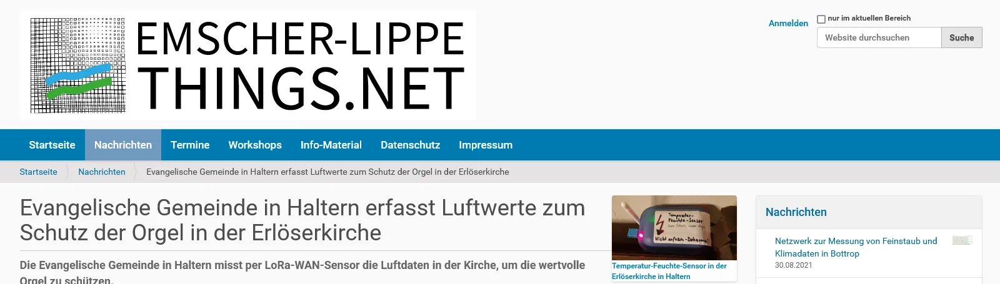

---

## Fazit

- **Das Netz steht im Rahmen des Projektverlaufs.** Statt der angenommenen 50 Gateways sind rund 85
  entstanden; die Emscher-Lippe-Region ist weitgehend mit LoRaWAN versorgt.
- **Bildung und Beteiligung wirken.** Mit Workshops, Lernpaketen und
  Hunderten Sensoren haben Schulen, Einrichtungen, Unternehmen sowie
  Bürgerinnen und Bürger das Internet der Dinge selbst ausprobiert – bis hin
  zu einem eigenen Messnetz in Bottrop, dessen Daten offen zugänglich sind.
- **Günstige Sensoren ersetzen keine Messstation.** Messlücken, Ausreißer,
  systematische Abweichungen und ein fehlerhafter Austauschsensor zeigen: Für
  belastbare Aussagen braucht es Kalibrierung, Vergleichsmessungen am selben
  Ort und eine laufende Kontrolle der Datenqualität. Als Ergänzung, die lokale
  Effekte sichtbar macht und für das Thema sensibilisiert, sind die Sensoren
  dagegen wertvoll.
- **Einfache Anwendungen zuerst.** Tür-, Temperatur-, CO₂- und GPS-Sensoren
  funktionierten zuverlässig, komplexere Anwendungen wie Parkplatz- oder
  Füllstandserkennung erwiesen sich als deutlich anspruchsvoller.

## Präsentation

Die vollständigen Folien der Schlussauswertung für den Expertenbeirat
(September 2021, 34 Folien):

[Präsentation als PDF herunterladen (5,2 MB)](eltn-evaluation-2021.pdf)


