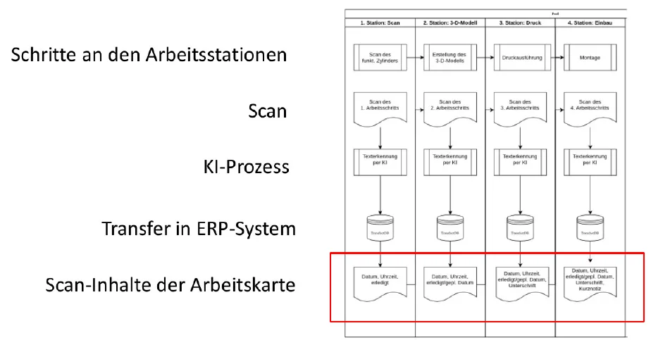
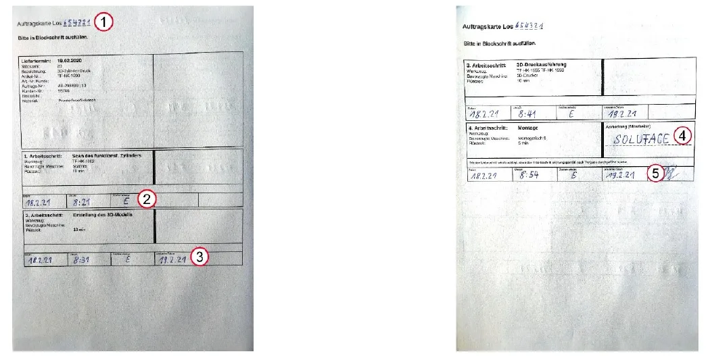
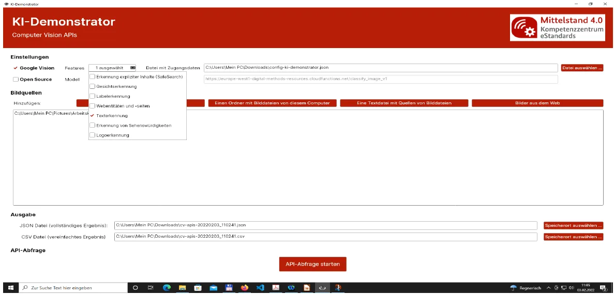
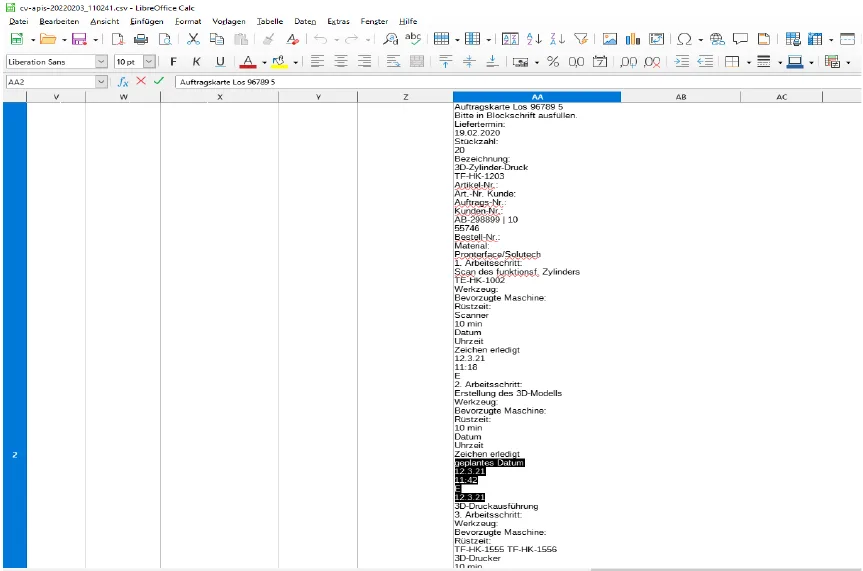
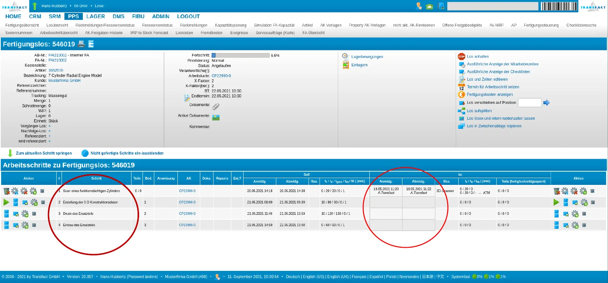

Wie kann ein kleiner Fertigungsbetrieb künstliche Intelligenz einsetzen, ohne
eigene Modelle zu entwickeln oder in teure Spezialsoftware zu investieren? Für
die **Offene Werkstatt an der FernUniversität Hagen** und die
**Wirtschaftsförderung Hagen** haben wir 2022 zwei KI-Demonstratoren entwickelt,
die genau das zeigen – mit frei verfügbaren Werkzeugen und an einem durchgängigen
Praxisbeispiel.

<!--more-->


Die Demonstratoren wurden im April 2022 bei der Wirtschaftsförderung Hagen
vorgestellt, im Kontext des *Mittelstand 4.0-Kompetenzzentrums eStandards*.
Die Präsentation steht [unten zum Download](#präsentation) bereit.
Angaben zu Werkzeugen und Preisen geben den Stand von 2022 wieder.


## Überblick

| | Demonstrator I | Demonstrator II |
|---|---|---|
| **Thema** | Von der Papierversion zur digitalen Arbeitskarte | Visuelle Erkennung von defekten Bauteilen |
| **KI-Verfahren** | Texterkennung (OCR) inkl. Handschrift | Bildklassifikation |
| **Werkzeuge** | KI-Demonstrator auf Basis von Memespector-GUI, Google Cloud Vision API | Lobe, USB-Makrokamera |
| **Ergebnis** | Erkannte Rückmeldedaten als CSV/JSON für das ERP-System | Trainiertes Modell, das Bauteile live per Kamera einordnet |

Beide Demonstratoren spielen am selben Szenario: der **Ersatzteilfertigung für
das Modell eines Siebenzylinder-Sternmotors**. Ein defekter Zylinder wird
ersetzt, indem ein funktionsfähiger Zylinder eingescannt, als 3-D-Modell
aufbereitet, im 3-D-Drucker gefertigt und schließlich eingebaut wird.

---

## I. Von der Papierversion zur digitalen Arbeitskarte

### Ausgangslage

In vielen Betrieben begleitet eine **Arbeitskarte auf Papier** den Auftrag durch
die Fertigung. An jeder Station wird von Hand eingetragen, wann ein
Arbeitsschritt begonnen und erledigt wurde. Diese Rückmeldungen landen
anschließend – wenn überhaupt – durch Abtippen im ERP-System. Das kostet Zeit,
ist fehleranfällig und verzögert den Überblick über den Fertigungsfortschritt.

Der Demonstrator zeigt, wie sich dieser Medienbruch schließen lässt, **ohne die
bewährte Papierkarte abzuschaffen**: Die Karte wird an jeder Station
fotografiert, eine KI liest die handschriftlichen Einträge, und die Ergebnisse
werden in das ERP-System übertragen.

### Der Prozess an vier Arbeitsstationen



| Station | Arbeitsschritt | Erfasste Inhalte der Arbeitskarte |
|---|---|---|
| 1. Scan | Scan des funktionsfähigen Zylinders | Datum, Uhrzeit, erledigt |
| 2. 3-D-Modell | Erstellung des 3-D-Modells | Datum, Uhrzeit, erledigt / geplantes Datum |
| 3. Druck | Druckausführung | Datum, Uhrzeit, erledigt / geplantes Datum, Unterschrift |
| 4. Einbau | Montage | Datum, Uhrzeit, erledigt / geplantes Datum, Unterschrift, Kurznotiz |

### Die Arbeitskarte

Grundlage ist eine zweiseitige Auftragskarte, die „in Blockschrift“ ausgefüllt
wird. Neben den vorgedruckten Auftragsdaten (Liefertermin, Stückzahl,
Artikelnummer, Material, Werkzeug, bevorzugte Maschine, Rüstzeit) enthält sie
die handschriftlichen Felder, die die KI erkennen soll:

1. die **Losnummer** im Kopf der Karte,
2. **Datum, Uhrzeit und Erledigt-Zeichen** je Arbeitsschritt,
3. das **geplante Datum** für den Folgeschritt,
4. eine **Anmerkung** der ausführenden Person,
5. die **Unterschrift** bei der Abnahme.



### Texterkennung per Cloud-Anwendung

Für die Texterkennung nutzt der Demonstrator eine Desktop-Anwendung, die Bilder
an Computer-Vision-Dienste in der Cloud schickt und die Antworten als Dateien
speichert. Die Bedienung kommt ohne Programmierkenntnisse aus:

{}

### Dienst und Funktion wählen

Unter *Einstellungen* wird **Google Vision** aktiviert und als Feature
**Texterkennung** ausgewählt. Die Zugangsdaten zum Google-Cloud-Projekt liegen
in einer JSON-Datei, die einmalig ausgewählt wird.

### Bildquellen hinzufügen

Die fotografierten Arbeitskarten werden als einzelne Dateien, als ganzer Ordner,
über eine Textdatei mit Bildpfaden oder als Bilder aus dem Web hinzugefügt.

### Ausgabe festlegen

Die Anwendung schreibt zwei Dateien: eine **JSON-Datei** mit dem vollständigen
Ergebnis und eine **CSV-Datei** mit einem vereinfachten Ergebnis.

### API-Abfrage starten

Ein Klick auf *API-Abfrage starten* verarbeitet alle Bilder; eine Meldung
bestätigt, dass die Ergebnisse in den Ausgabedateien stehen.

{}



Neben der Texterkennung bietet die Anwendung weitere Funktionen der Google Vision
API an – etwa Label-, Logo- und Gesichtserkennung, die Erkennung von
Sehenswürdigkeiten und Webentitäten sowie SafeSearch. Für den Demonstrator ist
nur die Texterkennung aktiv.

### Das Ergebnis: Text Zeile für Zeile

Die CSV-Datei lässt sich direkt in einer Tabellenkalkulation wie LibreOffice
Calc öffnen. Die KI liefert den erkannten Text der Karte in Lesereihenfolge –
vorgedruckte Beschriftungen ebenso wie die handschriftlichen Einträge:



Ein Ausschnitt für den zweiten Arbeitsschritt:

```text
2. Arbeitsschritt:
Erstellung des 3D-Modells
Werkzeug:
Bevorzugte Maschine:
Rüstzeit:
10 min
Datum
Uhrzeit
Zeichen erledigt
geplantes Datum
12.3.21        ← Datum (handschriftlich)
11:42          ← Uhrzeit (handschriftlich)
E              ← Erledigt-Zeichen (handschriftlich)
12.3.21        ← geplantes Datum (handschriftlich)
3D-Druckausführung
3. Arbeitsschritt:
…
```

Die in Blockschrift eingetragenen Werte werden zuverlässig erkannt. Das Beispiel
zeigt aber auch, was die KI **nicht** leistet: Sie liefert Text, keine
Struktur. Feldbezeichnungen („Datum“, „Uhrzeit“) und Werte stehen nacheinander,
nicht als Paare. Bevor die Daten ins ERP-System gehen, braucht es deshalb einen
Zuordnungsschritt, der die Werte anhand der festen Kartenstruktur den richtigen
Feldern zuweist. Genau hier hilft das einheitliche Layout der Arbeitskarte.

### Das Ziel: Rückmeldungen im ERP-System

Im ERP-System (im Demonstrator: Transfact) ist der Auftrag als Fertigungslos mit
den vier Arbeitsschritten angelegt – vom Scan des funktionstüchtigen Zylinders
bis zum Einbau des Ersatzteils. Für jeden Schritt stehen Soll-Termine bereit;
die **Ist-Anmeldung und -Abmeldung** sind die Felder, die aus der erkannten
Arbeitskarte gefüllt werden.



### Technischer Hintergrund

Der KI-Demonstrator ist eine deutschsprachige Anpassung von
[**Memespector-GUI**](https://github.com/jason-chao/memespector-gui), einem
Open-Source-Werkzeug von Jason Chao (Universität Siegen). Memespector-GUI ist
eine plattformübergreifende Desktop-Anwendung (C#, Windows, macOS, Linux), die
Bilder an verschiedene Computer-Vision-APIs schickt:

- Google Cloud Vision API
- Microsoft Azure Cognitive Services
- Clarifai Computer Vision
- eine experimentelle API mit Open-Source-Modellen von Keras (trainiert auf ImageNet)


Die eigentliche Erkennung übernimmt die **Google Cloud Vision API**. Sie wird
in einem Google-Cloud-Projekt aktiviert und rechnet pro Bild und Funktion ab.
Für einen Demonstrator oder einen kleinen Betrieb fallen dabei kaum Kosten an:

| Funktion | Erste 1.000 Einheiten/Monat | 1.001 – 5.000.000 Einheiten/Monat | ab 5.000.001 Einheiten/Monat |
|---|---|---|---|
| Texterkennung | kostenlos | 1,50 $ pro 1.000 | 0,60 $ pro 1.000 |
| Erkennung von Dokumenttext | kostenlos | 1,50 $ pro 1.000 | 0,60 $ pro 1.000 |
| Labelerkennung | kostenlos | 1,50 $ pro 1.000 | 1,00 $ pro 1.000 |

<small>Preise laut Google Cloud, Stand 2022. Eine Einheit entspricht einer
Funktion, angewendet auf ein Bild.</small>

Bei vier Scans pro Auftrag deckt das Freikontingent rund 250 Aufträge im Monat ab.


Bei Cloud-Diensten verlassen die Bilder das Unternehmen. Für Arbeitskarten mit
Kunden- oder Personaldaten (etwa Unterschriften) ist daher vorab zu klären, wo
die Daten verarbeitet werden und ob ein Vertrag zur Auftragsverarbeitung
vorliegt.


---

## II. Visuelle Erkennung von defekten Bauteilen

Der zweite Demonstrator zeigt, wie sich ein eigenes Bilderkennungsmodell
**ohne eine Zeile Code** trainieren lässt – etwa um gute von fehlerhaften
Bauteilen zu unterscheiden.

### Werkzeuge

- ein **Windows-10-PC** mit Internetzugang
- eine **USB-Makrokamera** für Detailaufnahmen kleiner Bauteile
- [**Lobe**](https://github.com/lobe), eine kostenlose Desktop-Anwendung von
  Microsoft zum Trainieren von Bildklassifikationsmodellen

### In drei Schritten zum eigenen Modell

Lobe gliedert die Arbeit in drei Bereiche, die in der Seitenleiste
nacheinander durchlaufen werden:

{}

### Label – Bilder sammeln und beschriften

Bilder werden von der Festplatte, als strukturierter Datensatz oder direkt über
die angeschlossene Kamera importiert und mit einem Label versehen. Pro Label
sind mindestens **fünf Bilder** nötig, bevor das Training startet.

### Train – Modell trainieren

Sobald genug Bilder vorliegen, beginnt Lobe selbstständig mit dem Training und
zeigt an, welcher Anteil der Bilder bereits richtig erkannt wird.

### Use – Modell anwenden und verbessern

Im Kamerabild wird das Ergebnis live eingeblendet. Über zwei Schaltflächen lässt
sich jede Vorhersage bestätigen oder korrigieren – das Bild wandert dann als
weiteres Trainingsbeispiel in den Datensatz.

{}

### Einstieg: Hammer oder Pinzette?

Zum Kennenlernen dient ein bewusst einfaches Beispiel. Mit der Kamera werden
Hammer und Pinzette in unterschiedlichen Lagen aufgenommen und beschriftet.

 (Microsoft).")

Mit 40 Hammer- und 12 Pinzetten-Bildern erkennt das Modell bereits alle Bilder
des Datensatzes richtig. Wird ein Bild falsch zugeordnet, lässt sich das Label
direkt korrigieren.

 (Microsoft).")

Im Modus *Use* ordnet das Modell neue Kamerabilder in Echtzeit zu:

 (Microsoft).")

### Anwendung: Bauteile des Sternmotors

Übertragen auf das Fertigungsszenario werden Aufnahmen des Sternmotor-Modells
und einzelner 3-D-gedruckter Teile trainiert. Für kleine Bauteile liefert die
USB-Makrokamera die nötige Detailschärfe.

 (Microsoft).")

Die so trainierten Modelle erreichen auf ihren Datensätzen **98 bis 100 %**
korrekte Vorhersagen – darunter ein Modell für ein 3-D-gedrucktes Bauteil auf
Basis von Makroaufnahmen.

 (Microsoft).")

Die Prozentwerte beziehen sich auf die Trainingsbilder selbst. Für den
produktiven Einsatz sollte ein Modell zusätzlich mit Bildern geprüft werden, die
es beim Training nicht gesehen hat – und mit möglichst vielen Beispielen echter
Fehlerbilder.

Trainierte Modelle lassen sich aus Lobe exportieren und in eigene Anwendungen
einbinden. Dafür stehen Open-Source-Vorlagen für iOS, Android, das Web, Python
und .NET sowie eine REST-Schnittstelle bereit.

---

## Fazit

Beide Demonstratoren zeigen, dass der Einstieg in KI für kleine und mittlere
Unternehmen weder eigene Data-Science-Teams noch große Budgets erfordert:

- **Texterkennung aus der Cloud** macht handschriftliche Rückmeldungen
  maschinenlesbar, die Papierkarte bleibt als vertrautes Werkzeug erhalten. Die
  eigentliche Integrationsarbeit liegt in der Zuordnung der erkannten Werte zu
  den ERP-Feldern.
- **Bildklassifikation ohne Code** erlaubt es Fachkräften, mit wenigen Dutzend
  Bildern ein eigenes Prüfmodell aufzubauen und schrittweise zu verbessern.

## Verwendete Open-Source-Software

| Software | Lizenz | Beschreibung |
|---|---|---|
| [Memespector-GUI](https://github.com/jason-chao/memespector-gui) | MIT | Plattformübergreifender Client für Computer-Vision-APIs (Google Cloud Vision, Microsoft Azure Cognitive Services, Clarifai, Keras-Modelle) |
| [Lobe](https://github.com/lobe) | MIT | Offene REST-Schnittstelle und Open-Source-Anwendungen für iOS, Android, Web, Python und .NET |

## Präsentation

Die vollständigen Folien der Vorstellung bei der Wirtschaftsförderung Hagen
(April 2022, 31 Folien):

[Präsentation als PDF herunterladen (4,4 MB)](ki-demonstrator-praesentation-2022.pdf)


